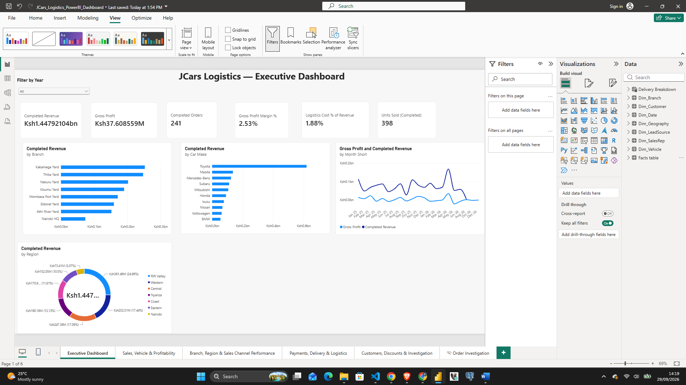
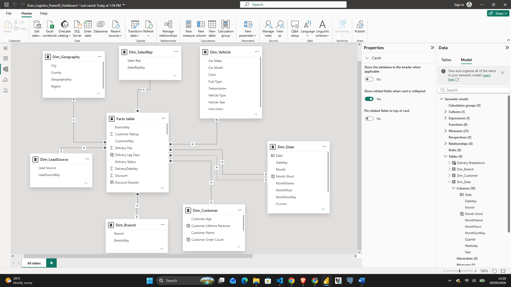
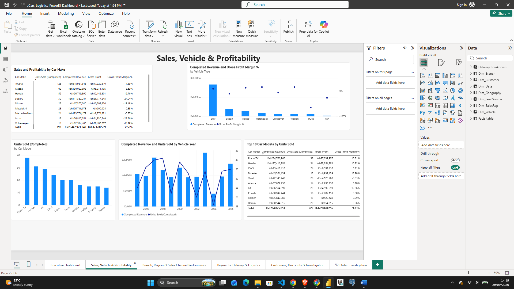
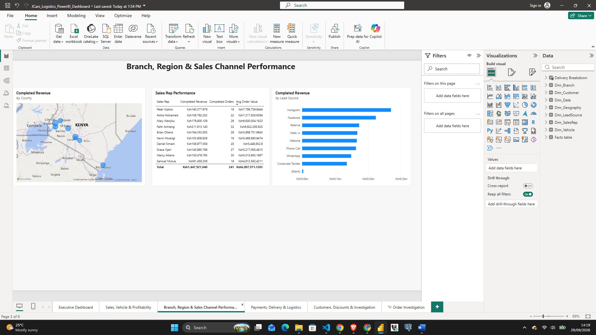
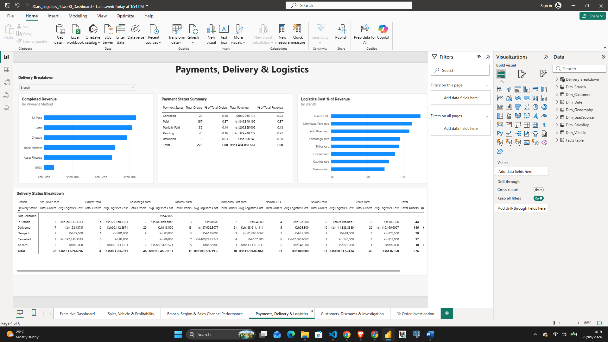
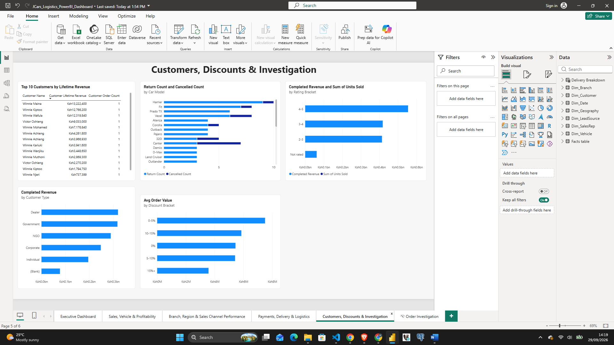
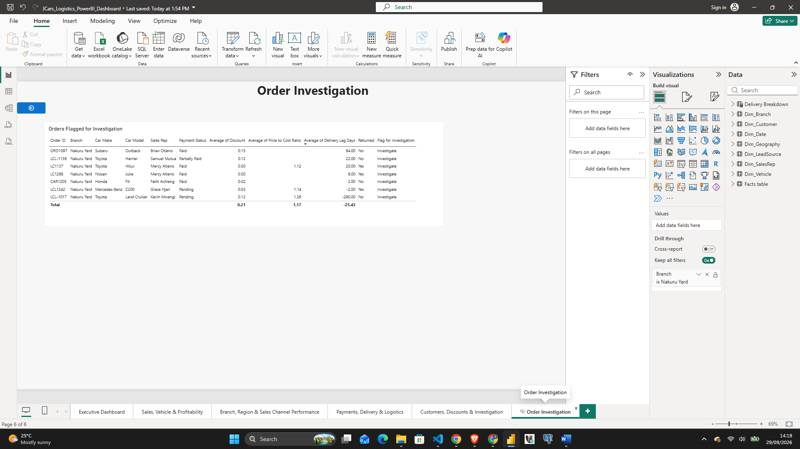

# JCars Logistics: Sales, Delivery & Profitability Dashboard

A Power BI report analysing vehicle sales, profitability, payments, delivery and logistics performance for JCars across Kenya. It gives management one place to see revenue, margins, delivery performance and the orders that need investigation.



## Contents

1. [Project Objective](#1-project-objective)
2. [Dataset](#2-dataset)
3. [Data Quality Issues Identified](#3-data-quality-issues-identified)
4. [Cleaning and Transformation Approach](#4-cleaning-and-transformation-approach)
5. [Currency Standardisation](#5-currency-standardisation)
6. [Assumptions and Business Rules](#6-assumptions-and-business-rules)
7. [Data Model](#7-data-model)
8. [Important DAX Measures](#8-important-dax-measures)
9. [Executive Dashboard](#9-executive-dashboard)
10. [Detailed Report Pages](#10-detailed-report-pages)
11. [Key Insights](#11-key-insights)
12. [Management Recommendations](#12-management-recommendations)
13. [Repository Structure](#13-repository-structure)
14. [How to Open the Report](#14-how-to-open-the-report)

---

## 1. Project Objective

Build an interactive Power BI dashboard that gives JCars management a clear view of business performance and answers these questions:

- How have revenue, units sold and gross profit changed over time?
- Which car makes and models generate strong (or weak) margins?
- How does delivery performance vary across regions, branches and vehicles?
- How do payment status, discounts and customer types affect revenue?
- Which orders should be investigated?

## 2. Dataset

| Item | Detail |
|---|---|
| File | `data/Jcars_data.csv` (original, uncleaned) |
| Orders | 276 in total, 241 of them completed |
| Period | Orders placed in 2025 and 2026 |
| Vehicle model years | 2016 to 2026 |
| Grain | One row per order |
| Currency | Kenyan Shillings (Ksh) |
| Regions | Central, Coast, Eastern, Nairobi, Nyanza, Rift Valley, Western |
| Branches | Nairobi HQ, Mombasa Port Yard, Athi River Yard, Kakamega Yard, Thika Yard, Eldoret Yard, Kisumu Yard, Nakuru Yard |

The dataset in this repository is the original file. The cleaning and shaping described below is applied in Power Query inside the `.pbix`.

## 3. Data Quality Issues Identified

| Issue | Where | Treatment |
|---|---|---|
| Missing delivery status (1 order) | Delivery Status | Labelled **Not Recorded** in Power Query so it shows as its own category |
| Orders with no matching date (blank year and month) | Order date | Blank hidden from the Year slicer, so users only choose real years |
| Missing vehicle type | Vehicle Type | Blank excluded from the vehicle-type chart |
| Inconsistent Order ID formats (`LC1192`, `LCL-1094`, `ORD1229`, `CAR1084`) | Order ID | Kept as recorded. The ID is used only to identify an order |
| Negative delivery lag values (for example -209 and -315 days) | Delivery Lag | Kept and shown on the Order Investigation page for review |
| Extreme price-to-cost ratios (for example 13.05) | Price to Cost Ratio | Flagged on the Order Investigation page |
| Repeated customer names with different revenue | Customer | Customers are identified by CustomerKey, so repeated names are treated as separate customers |

## 4. Cleaning and Transformation Approach

Cleaning and shaping were done in **Power Query** before loading the model:

1. Loaded the source file and set the correct data type for each column.
2. Replaced null Delivery Status values with `Not Recorded`.
3. Organised the data into a star schema: one fact table (orders) and dimension tables for branch, customer, date, geography, lead source, sales rep and vehicle.
4. Added a `Flag for Investigation` field so unusual orders can be reviewed on a dedicated page.
5. Added a calculated `Month Short` column (for example Jan 25) on the date table, sorted by `MonthSortKey`, so month labels are short and in date order.


## 5. Currency Standardisation

All monetary values in the report (revenue, cost, gross profit, logistics cost, delivery fees, customer lifetime revenue) are expressed in **Kenyan Shillings (Ksh)**, so amounts can be compared directly across every page and visual.

## 6. Assumptions and Business Rules

- **Headline KPIs use completed orders.** Completed Revenue, Gross Profit, Completed Orders and Units Sold (Completed) describe orders that reached completion. Cancelled and refunded orders are reported separately on the Payments, Delivery & Logistics page.
- **Gross Profit Margin %** is Gross Profit divided by Total Revenue.
- **Logistics Cost % of Revenue** compares logistics cost with revenue and is shown by branch.
- **Top 10 car models** on the Sales page are ranked by completed units sold, which avoids models with only one or two sales dominating the margin ranking.
- **Vehicle Year** is the model year of the car, not the order date. Trends over time use the order date.
- **Order Investigation** lists orders flagged for review, sorted by price-to-cost ratio.
- **Delivery Breakdown** is a field parameter. The delivery matrix on the Payments, Delivery & Logistics page switches between Region, Branch and Vehicle Type.

## 7. Data Model

Star schema with one fact table and seven dimension tables.

| Table | Type | Relates on |
|---|---|---|
| Facts table | Fact (one row per order) | OrderDateKey, BranchKey, CustomerKey, VehicleKey, GeographyKey, LeadSourceKey, SalesRepKey |
| Dim_Branch | Dimension | BranchKey |
| Dim_Customer | Dimension | CustomerKey |
| Dim_Date | Dimension | DateKey |
| Dim_Geography | Dimension | GeographyKey |
| Dim_LeadSource | Dimension | LeadSourceKey |
| Dim_SalesRep | Dimension | SalesRepKey |
| Dim_Vehicle | Dimension | VehicleKey |



A column-by-column list is in [docs/data-dictionary.md](docs/data-dictionary.md).

## 8. Important DAX Measures

```DAX
Gross Profit Margin % =
DIVIDE ( [Gross Profit], [Total Revenue] )
```

```DAX
Month Short = FORMAT ( Dim_Date[Date], "mmm yy" )   -- calculated column, sorted by MonthSortKey
```

| Measure | Purpose |
|---|---|
| Completed Revenue | Revenue from completed orders |
| Gross Profit | Profit on completed orders |
| Completed Orders | Number of completed orders |
| Units Sold (Completed) | Vehicles sold on completed orders |
| Total Revenue / Total Orders | Revenue and order count across all orders |
| % of Total Orders / % of Total Revenue | Share of orders and revenue by category, used in the payment summary |
| Logistics Cost % of Revenue | Logistics cost as a share of revenue, by branch |
| Avg Logistics Cost | Average logistics cost per order |
| Avg Order Value | Average revenue per order, by discount bracket |
| Return Count / Cancelled Count | Returned and cancelled orders by car model |

A short description of each measure is in [docs/dax-measures.md](docs/dax-measures.md).

## 9. Executive Dashboard

Six headline cards: **Completed Revenue** (Ksh1.45bn), **Gross Profit** (Ksh37.6M), **Completed Orders** (241), **Gross Profit Margin %** (2.53%), **Logistics Cost % of Revenue** (1.88%) and **Units Sold (Completed)** (398). A Year slicer filters the whole page.

Below the cards: completed revenue by branch, by car make and by region, plus a monthly trend of gross profit and completed revenue.


## 10. Detailed Report Pages

### Sales, Vehicle & Profitability
Sales and profitability by car make and by top 10 car models, completed revenue and gross profit margin by vehicle type, units sold by car model, and revenue and units by vehicle year.



### Branch, Region & Sales Channel Performance
Compares performance across branches, regions and sales channels.



### Payments, Delivery & Logistics
Revenue by payment method, a payment status summary (orders and revenue, count and share), logistics cost % of revenue by branch, and a delivery status matrix that switches between Region, Branch and Vehicle Type.



### Customers, Discounts & Investigation
Top customers by lifetime revenue, returns and cancellations by car model, revenue by rating bracket and customer type, and average order value by discount bracket.



### Order Investigation (hidden detail page)
Orders flagged for investigation, with price-to-cost ratio, delivery lag, discount, payment status and returned status.



## 11. Key Insights

- **Thin margins.** Completed revenue is about Ksh1.45bn and gross profit about Ksh37.6M, a margin of roughly 2.5%. Logistics cost is 1.88% of revenue.
- **Toyota leads on volume.** It sold the most units (125) and generated the most revenue. Volkswagen (44%) and Subaru (24%) show the strongest margins.
- **Several makes lose money.** BMW (-35%), Isuzu (-28%), Nissan (-15%), Honda (-13%) and Mercedes-Benz (-7%) have negative gross profit on completed sales.
- **Regional concentration.** Rift Valley is the largest region, at about 25% of revenue.
- **Branches.** Kakamega Yard has the highest completed revenue and Nairobi HQ the lowest, yet Nairobi HQ has the highest logistics cost as a share of revenue.
- **Payments.** M-Pesa is the most used payment method by revenue. By order count, 57% of orders are paid, 16% pending, 14% partially paid, 10% cancelled and 3% refunded. Pending and partially paid orders together account for about 40% of revenue.
- **Delivery.** Of 276 orders, 146 were delivered, 44 are in transit, 30 are at the yard, 18 are delayed and 37 were cancelled.
- **Discounts.** Average order value is highest in the 0-5% discount bracket and lowest in the 15%+ bracket.
- **Customers.** Dealers generate the most revenue by customer type, followed by Government and NGO buyers.

## 12. Management Recommendations

1. **Review pricing and costs on loss-making makes** (BMW, Isuzu, Nissan, Honda, Mercedes-Benz) before buying more stock, and concentrate on makes with healthy margins.
2. **Investigate logistics cost at Nairobi HQ and other high-cost branches**, where delivery cost is high relative to revenue.
3. **Reduce delayed and at-yard orders.** 48 orders are delayed or waiting at the yard, which ties up stock and delays revenue.
4. **Improve cash collection.** Follow up on pending and partially paid orders, which represent about 40% of revenue.
5. **Set a discount policy.** Average order value falls as discounts rise, so approve larger discounts only where volume justifies them.
6. **Review flagged orders** on the Order Investigation page, starting with the highest price-to-cost ratios and negative delivery lags, to confirm whether they are data errors or genuine problems.
7. **Fix data gaps at source.** Capture order dates, vehicle types and delivery status when an order is created so they no longer appear as blank or Not Recorded.

## 13. Repository Structure

```
JCars-Logistics-PowerBI/
├── README.md
├── JCars_Logistics_PowerBI_Dashboard.pbix
├── data/
│   └── Jcars_data.csv
├── screenshots/
│   ├── 01-executive-dashboard.png
│   ├── 02-sales-vehicle-profitability.png
│   ├── 03-branch-region-channel.png
│   ├── 04-payments-delivery-logistics.png
│   ├── 05-customers-discounts-investigation.png
│   ├── 06-order-investigation.png
│   └── data-model.png
└── docs/
    ├── data-dictionary.md
    └── dax-measures.md
```

## 14. How to Open the Report

1. Install [Power BI Desktop](https://powerbi.microsoft.com/desktop/) (Windows only).
2. Download `JCars_Logistics_PowerBI_Dashboard.pbix`.
3. Open it. If prompted, point the data source to the file in the `data` folder.

**Tools used:** Power BI Desktop, Power Query, DAX, Git and GitHub.
